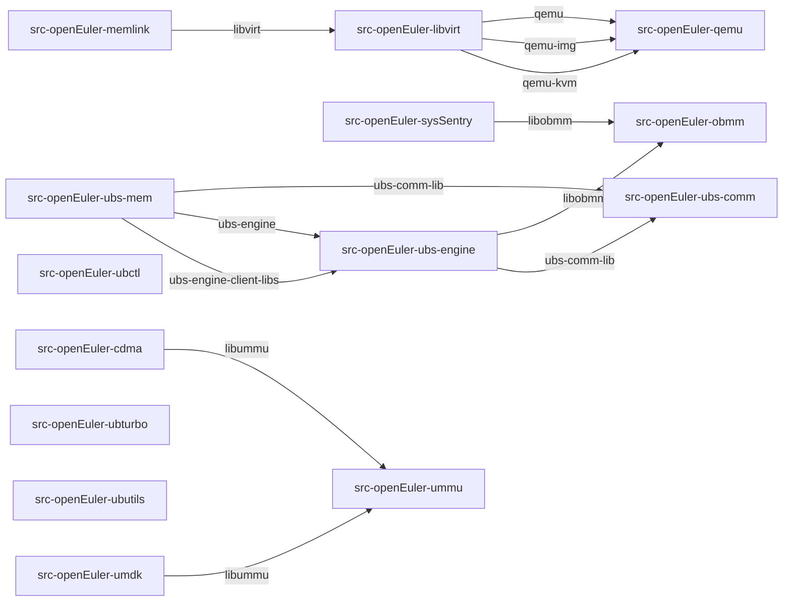

# RPM Spec Install Dependency Topology

## Summary

- Repositories: 14
- Internal dependency edges: 12
- Repositories with external install requirements: 10

## Topology

## Internal Edges

| Source Repository | Target Repository | Required Package |
| --- | --- | --- |
| src-openEuler-cdma | src-openEuler-ummu | libummu |
| src-openEuler-libvirt | src-openEuler-qemu | qemu |
| src-openEuler-libvirt | src-openEuler-qemu | qemu-img |
| src-openEuler-libvirt | src-openEuler-qemu | qemu-kvm |
| src-openEuler-memlink | src-openEuler-libvirt | libvirt |
| src-openEuler-sysSentry | src-openEuler-obmm | libobmm |
| src-openEuler-ubs-engine | src-openEuler-obmm | libobmm |
| src-openEuler-ubs-engine | src-openEuler-ubs-comm | ubs-comm-lib |
| src-openEuler-ubs-mem | src-openEuler-ubs-comm | ubs-comm-lib |
| src-openEuler-ubs-mem | src-openEuler-ubs-engine | ubs-engine |
| src-openEuler-ubs-mem | src-openEuler-ubs-engine | ubs-engine-client-libs |
| src-openEuler-umdk | src-openEuler-ummu | libummu |

## Parsed Specs

| Repository | Spec Path | Packages | Provides |
| --- | --- | --- | --- |
| src-openEuler-cdma | work/repos/src-openEuler-cdma/cdma.spec | libcdma, libcdma-devel | - |
| src-openEuler-libvirt | work/repos/src-openEuler-libvirt/libvirt.spec | libvirt, libvirt-client, libvirt-client-qemu, libvirt-daemon, libvirt-daemon-common, libvirt-daemon-config-network, libvirt-daemon-config-nwfilter, libvirt-daemon-driver-interface, libvirt-daemon-driver-libxl, libvirt-daemon-driver-lxc, libvirt-daemon-driver-network, libvirt-daemon-driver-nodedev, libvirt-daemon-driver-nwfilter, libvirt-daemon-driver-qemu, libvirt-daemon-driver-secret, libvirt-daemon-driver-storage, libvirt-daemon-driver-storage-core, libvirt-daemon-driver-storage-disk, libvirt-daemon-driver-storage-gluster, libvirt-daemon-driver-storage-iscsi, libvirt-daemon-driver-storage-iscsi-direct, libvirt-daemon-driver-storage-logical, libvirt-daemon-driver-storage-mpath, libvirt-daemon-driver-storage-rbd, libvirt-daemon-driver-storage-scsi, libvirt-daemon-driver-storage-zfs, libvirt-daemon-driver-vbox, libvirt-daemon-kvm, libvirt-daemon-lock, libvirt-daemon-log, libvirt-daemon-lxc, libvirt-daemon-plugin-lockd, libvirt-daemon-plugin-sanlock, libvirt-daemon-proxy, libvirt-daemon-qemu, libvirt-daemon-vbox, libvirt-daemon-xen, libvirt-devel, libvirt-docs, libvirt-libs, libvirt-login-shell, libvirt-nss, libvirt-wireshark, mingw32-libvirt, mingw64-libvirt | libvirt-admin, libvirt-lock-sanlock |
| src-openEuler-memlink | work/repos/src-openEuler-memlink/memlink.spec | memlinkd | - |
| src-openEuler-obmm | work/repos/src-openEuler-obmm/obmm.spec | libobmm, libobmm-devel | - |
| src-openEuler-qemu | work/repos/src-openEuler-qemu/qemu.spec | qemu, qemu-block-curl, qemu-block-iscsi, qemu-block-rbd, qemu-block-ssh, qemu-guest-agent, qemu-help, qemu-hw-usb-host, qemu-img, qemu-seabios, qemu-system-aarch64, qemu-system-arm, qemu-system-loongarch64, qemu-system-ppc64, qemu-system-riscv, qemu-system-x86_64, qemu-user, qemu-user-binfmt, qemu-user-static | qemu-kvm |
| src-openEuler-sysSentry | work/repos/src-openEuler-sysSentry/sysSentry.spec | ai_block_io, avg_block_io, bmc_block_io, hbm_online_repair, libxalarm, libxalarm-devel, pysentry_collect, pysentry_notify, sentry_msg_monitor, soc_ring_sentry, sysSentry | bmc_block_io, hbm_online_repair, libxalarm, libxalarm-devel, pyxalarm, sentry_msg_monitor, soc_ring_sentry |
| src-openEuler-ubctl | work/repos/src-openEuler-ubctl/ubctl.spec | ubctl, ubctl-devel | - |
| src-openEuler-ubs-comm | work/repos/src-openEuler-ubs-comm/hcom.spec | ubs-comm, ubs-comm-devel, ubs-comm-lib | - |
| src-openEuler-ubs-engine | work/repos/src-openEuler-ubs-engine/ubs-engine.spec | python3-ubs-engine, ubs-engine, ubs-engine-client-devel, ubs-engine-client-libs, ubs-engine-rmrs, ubs-engine-ucache, ubs-engine-virtagent | libubse-client.so.1, ubs-engine-client-devel, ubs-engine-client-libs |
| src-openEuler-ubs-mem | work/repos/src-openEuler-ubs-mem/ubs-mem.spec | ubs-mem, ubs-mem-shmem | ubs-mem-kshmem |
| src-openEuler-ubturbo | work/repos/src-openEuler-ubturbo/ubturbo.spec | ubturbo, ubturbo-devel, ubturbo-rmrs, ubturbo-smap, ubturbo-ubdma, ubturbo-ucache | ubturbo |
| src-openEuler-ubutils | work/repos/src-openEuler-ubutils/ubutils.spec | ubutils, ubutils-devel | - |
| src-openEuler-umdk | work/repos/src-openEuler-umdk/umdk.spec | umdk, umdk-dlock-devel, umdk-dlock-example, umdk-dlock-lib, umdk-ums, umdk-ums-tools, umdk-urma-bin, umdk-urma-devel, umdk-urma-example, umdk-urma-lib, umdk-urma-test, umdk-urma-tools, umdk-urpc-framework, umdk-urpc-framework-devel, umdk-urpc-framework-example, umdk-urpc-framework-tools, umdk-urpc-umq, umdk-urpc-umq-devel, umdk-urpc-umq-example, umdk-urpc-umq-tools | - |
| src-openEuler-ummu | work/repos/src-openEuler-ummu/ummu.spec | libummu, libummu-devel | - |

## External Install Requirements

- `src-openEuler-libvirt`: `augeas`, `bzip2`, `cyrus-sasl`, `cyrus-sasl-gssapi`, `dbus`, `device-mapper`, `dmidecode`, `dnsmasq`, `ebtables`, `gettext`, `gettext-runtime`, `gluster`, `glusterfs-client`, `gnutls-utils`, `gzip`, `iproute`, `iproute-tc`, `iptables`, `iscsi-initiator-utils`, `lvm2`, `lzop`, `module-init-tools`, `netcf-libs`, `nfs-utils`, `numad`, `parted`, `pkgconfig`, `polkit`, `python3-cryptography`, `python3-libvirt`, `python3-lxml`, `sanlock`, `shadow-utils`, `swtpm-tools`, `systemctl`, `systemd`, `systemd-container`, `util-linux`, `wireshark`, `xen`, `xz`, `zfs`, `zpool`
- `src-openEuler-memlink`: `libboundscheck`, `systemd-units`
- `src-openEuler-qemu`: `getent`, `groupadd`, `libgcc`, `liburing`, `spice-gtk`, `systemd`, `systemd-units`, `useradd`
- `src-openEuler-sysSentry`: `ipmitool`, `json-c`, `json-c-devel`, `libbpf`, `libtraceevent`, `lsof`, `nvme-cli`, `python3-numpy`
- `src-openEuler-ubctl`: `libubctl`
- `src-openEuler-ubs-comm`: `libboundscheck`
- `src-openEuler-ubs-engine`: `coreutils`, `cpp-httplib`, `gawk`, `glibc`, `glibc-common`, `grep`, `libboundscheck`, `libgcc`, `libstdc++`, `libxml2`, `openssl-libs`, `pkgconfig`, `sed`, `shadow`, `systemd`, `tar`, `util-linux`
- `src-openEuler-ubs-mem`: `glibc`, `libboundscheck`, `libgcc`, `libstdc++`, `openssl-libs`
- `src-openEuler-ubturbo`: `coreutils`, `kernel`
- `src-openEuler-umdk`: `glib2`, `glibc`, `libasan`, `libnl3`, `libtsan`
